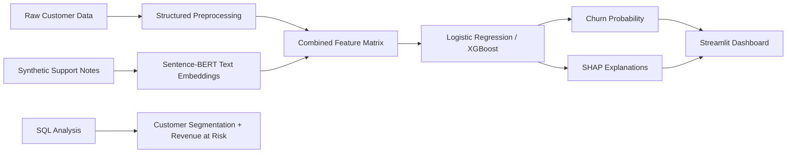

# Multimodal Churn Risk Detection

An end-to-end churn intelligence project that combines structured customer data, synthetic support-note text, machine learning, SQL analysis, SHAP explainability, and a Streamlit application to identify high-risk customers and support retention decision-making.

## Table of Contents

| Section | Link |
|---|---|
| Project Overview | [Go to section](#project-overview) |
| Tech Stack | [Go to section](#tech-stack) |
| System Architecture | [Go to section](#system-architecture) |
| Project Structure | [Go to section](#project-structure) |
| Dataset | [Go to section](#dataset) |
| Methodology | [Go to section](#methodology) |
| SQL Analysis | [Go to section](#sql-analysis) |
| Results | [Go to section](#results) |
| Streamlit Application | [Go to section](#streamlit-application) |
| Application Screenshots | [Go to section](#application-screenshots) |
| Run Locally | [Go to section](#run-locally) |
| Business Impact | [Go to section](#business-impact) |
| Recommended Retention Actions | [Go to section](#recommended-retention-actions) |
| Future Improvements | [Go to section](#future-improvements) |

## Project Overview

Customer churn is a major business risk across subscription-based industries. This project builds a multimodal churn prediction system that:

- Uses structured customer, service, and billing data
- Incorporates unstructured support-note style text via NLP embeddings
- Produces interpretable predictions using SHAP
- Deploys predictions and explanations through a Streamlit web app

The focus is not only predictive performance, but also model transparency and usability in real-world decision-making.

## Tech Stack

| Category | Tools |
|---|---|
| Programming | Python, SQL |
| Data Analysis | pandas, NumPy |
| Machine Learning | scikit-learn, XGBoost |
| NLP | Sentence-BERT, `all-MiniLM-L6-v2` |
| Explainability | SHAP |
| Deployment | Streamlit |
| Visualization | Matplotlib, Streamlit charts |
| Model Persistence | joblib |

## System Architecture



## Project Structure

```text
multimodal-risk-detection/
|-- app/
|   `-- streamlit_app.py
|-- data/
|   |-- processed/
|   |-- raw/
|   `-- sample/
|-- models/
|   |-- model_logreg.joblib
|   `-- model_xgb.joblib
|-- notebooks/
|   |-- 01_eda.ipynb
|   |-- 02_text_embeddings.ipynb
|   |-- 03_modeling.ipynb
|   `-- 04_explainability.ipynb
|-- reports/
|   |-- figures/
|   |-- business_summary.md
|   |-- logreg_lift_gain_table.csv
|   |-- model_evaluation.csv
|   |-- model_evaluation.json
|   `-- model_metrics.json
|-- sql/
|   |-- churn_by_contract.sql
|   |-- churn_by_payment_method.sql
|   |-- customer_segmentation.sql
|   `-- revenue_at_risk.sql
|-- src/
|   |-- evaluate_model.py
|   |-- generate_support_notes.py
|   |-- make_features.py
|   |-- train_model.py
|   `-- validate_input.py
|-- requirements.txt
`-- README.md
```

## Dataset

- Source: [IBM Telco Customer Churn Dataset](https://www.kaggle.com/datasets/blastchar/telco-customer-churn/data)
- Includes customer demographics, service subscriptions, billing information, and churn labels
- Unstructured text is synthetically generated from existing attributes to simulate customer support notes

Synthetic text is used to demonstrate multimodal modeling and explainability in a realistic business setting.

## Methodology

### 1. Exploratory Data Analysis

- Target imbalance analysis
- Numeric feature distributions and outliers
- Churn rates by contract type, service category, and payment method
- Identification of key churn drivers such as tenure and contract length

### 2. Feature Engineering

- Numeric features: median imputation
- Categorical features: one-hot encoding
- Text features: Sentence-BERT (`all-MiniLM-L6-v2`) embeddings
- Concatenation of structured and unstructured feature spaces

### 3. Modeling

Two models were trained and compared:

- Logistic Regression
- XGBoost

Evaluation metrics:

- ROC-AUC
- Precision-Recall AUC
- Accuracy
- Precision
- Recall
- F1
- Lift at the top 10 percent

Best model: Logistic Regression

It was chosen for strong performance in high-dimensional feature space and superior interpretability.

### 4. Explainability

- Global explainability: SHAP beeswarm plots in notebooks
- Local explainability: SHAP waterfall plots in the Streamlit app
- Feature names mapped back to human-readable variables

### 5. Deployment

- Interactive Streamlit app
- CSV upload scoring
- Manual entry scoring
- SHAP explanations in real time
- Revenue-at-risk summaries for scored batches

## SQL Analysis

To support business-facing churn analysis, this project includes SQL queries for customer segmentation and revenue-at-risk analysis.

The SQL layer answers questions such as:

- Which contract types have the highest churn rates?
- Which payment methods are associated with higher churn?
- How much monthly revenue is tied to churned customers?
- Which tenure and contract combinations represent the highest-risk customer segments?

| SQL File | Purpose |
|---|---|
| `churn_by_contract.sql` | Compares churn rates across contract types |
| `churn_by_payment_method.sql` | Identifies payment methods associated with higher churn |
| `revenue_at_risk.sql` | Estimates monthly revenue tied to churned customers |
| `customer_segmentation.sql` | Segments customers by tenure and contract risk |

## Results

| Model | ROC-AUC | PR-AUC | Accuracy | Precision | Recall | F1 | Lift@Top 10% |
|---|---:|---:|---:|---:|---:|---:|---:|
| Logistic Regression | **0.847** | 0.654 | 0.744 | 0.512 | **0.807** | **0.627** | **2.85** |
| XGBoost | 0.846 | **0.654** | **0.804** | **0.658** | 0.545 | 0.596 | 2.83 |

Key takeaways:

- The engineered feature space is largely linearly separable, allowing a simpler linear model to outperform a more complex ensemble while remaining explainable.
- Logistic Regression was selected as the primary model because it achieved the strongest recall and lift among the top-ranked customers, making it more useful for proactive churn prevention.

Additional evaluation outputs now include:

- Lift curve
- Cumulative gains curve
- Decile-level lift/gain table in `reports/logreg_lift_gain_table.csv`

## Streamlit Application

The Streamlit app now supports:

- Uploading a CSV with one or more customers
- Predicting churn probability
- Selecting a row for a detailed SHAP waterfall explanation
- Viewing top contributing features
- Showing revenue-at-risk summaries for scored batches
- Running automated validation checks before batch scoring

### Validation Checks

Before scoring, the app checks for:

- Missing required columns
- Non-numeric values in numeric columns
- Duplicate `customerID` values
- High missing-value rates
- Suspicious charge relationships such as `TotalCharges < MonthlyCharges`
- Unseen categorical values that will be ignored by the model

## Application Screenshots

### Streamlit Interface


This is the main entry point to the application and supports both CSV upload and row-level inspection.

### Churn Prediction Output Table


This view displays uploaded customer records alongside predicted churn probabilities for batch scoring workflows.

### SHAP Explainability


This explanation view highlights the feature-level contributions that increase or decrease the churn prediction for a selected customer.

## Run Locally

```bash
git clone https://github.com/efazHossain/multimodal-risk-detection.git
cd multimodal-risk-detection
python3 -m venv .venv
source .venv/bin/activate
pip install -r requirements.txt
python3 src/train_model.py
python3 src/evaluate_model.py
streamlit run app/streamlit_app.py
```

## Business Impact

This model is designed to help a retention team prioritize outreach by ranking customers based on churn probability. Instead of treating all customers equally, the business can focus retention campaigns on the highest-risk segments.

Potential use cases:

- Identify high-risk month-to-month customers
- Estimate revenue at risk from likely churners
- Prioritize outreach under a limited retention budget
- Use SHAP explanations to personalize retention offers

## Recommended Retention Actions

| Churn Driver | Business Interpretation | Suggested Action |
|---|---|---|
| Low tenure | New customers may not be fully committed | Onboarding campaign |
| Month-to-month contract | Easier cancellation path | Discount for annual contract |
| High monthly charges | Price sensitivity | Bundle or loyalty discount |
| No tech support | Support friction | Proactive service outreach |
| Electronic check | Billing/payment friction | Promote autopay alternatives |

## Future Improvements

### Business-Aware Threshold Selection

While ROC-AUC and PR-AUC evaluate ranking performance, real-world churn interventions require selecting an operating threshold that balances business costs.

In a churn context:

- False negatives lead to lost customers and revenue
- False positives incur unnecessary retention costs

Rather than defaulting to a 0.5 cutoff, thresholds can be tuned to:

- Maximize expected profit
- Minimize customer loss under a fixed retention budget
- Prioritize recall for high-value customers

The recent planned improvements have now been implemented:

- Lift and gain charts to evaluate how well the model prioritizes the highest-risk customers
- A revenue-at-risk dashboard that estimates potential monthly revenue loss from likely churners
- Automated data validation checks before batch scoring

Additional logical next steps could include:

- Threshold optimization based on business constraints
- Calibration analysis for predicted churn probabilities
- Revenue-at-risk tracking by segment and cohort inside the app
