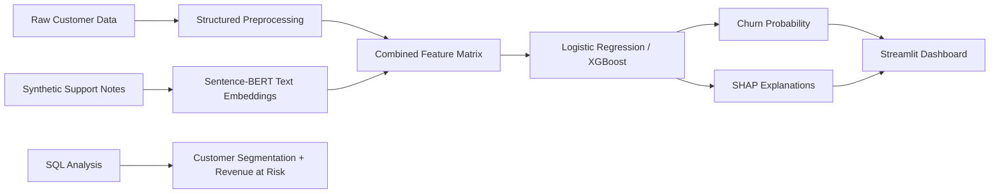

# Multimodal Churn Risk Detection

An end-to-end churn intelligence system that combines structured customer data, synthetic support-note text, machine learning, SQL analysis, SHAP explainability, and a Streamlit application to identify high-risk customers and support retention decision-making.

---

## 🚀 Project Overview

Customer churn is a major business risk across subscription-based industries.  
This project builds a **multimodal churn prediction system** that:

- Uses **structured customer, service, and billing data**
- Incorporates **unstructured support-note style text** via NLP embeddings
- Produces **interpretable predictions** using SHAP
- Deploys predictions and explanations through a **Streamlit web app**

The focus is not only predictive performance, but **model transparency and usability** in real-world decision-making.

---

## Tech Stack

| Category | Tools |
|---|---|
| Programming | Python, SQL |
| Data Analysis | pandas, NumPy |
| Machine Learning | scikit-learn, XGBoost |
| NLP | Sentence-BERT, `all-MiniLM-L6-v2` |
| Explainability | SHAP |
| Deployment | Streamlit |
| Visualization | Matplotlib, Streamlit charts |
| Model Persistence | joblib |

## System Architecture



## Project Structure

```text
multimodal-risk-detection/
│
├── app/
│   └── streamlit_app.py
│
├── data/
│   ├── raw/
│   ├── processed/
│   └── sample/
│
├── models/
│   ├── model_logreg.joblib
│   └── model_xgb.joblib
│
├── notebooks/
│   ├── 01_eda.ipynb
│   ├── 02_text_embeddings.ipynb
│   ├── 03_modeling.ipynb
│   └── 04_explainability.ipynb
│
├── reports/
│   ├── figures/
│   └── business_summary.md
│
├── sql/
│   ├── churn_by_contract.sql
│   ├── churn_by_payment_method.sql
│   ├── revenue_at_risk.sql
│   └── customer_segmentation.sql
│
├── src/
    ├── requirements.txt
    ├── generate_support_notes.py
    ├── make_features.py
    ├── train_model.py
    └── evaluate_model.py
└── README.md
```
## 📊 Dataset

- **IBM Telco Customer Churn Dataset** (Kaggle) https://www.kaggle.com/datasets/blastchar/telco-customer-churn/data
- Includes customer demographics, service subscriptions, billing information, and churn labels
- Unstructured text is **synthetically generated** from existing attributes to simulate customer support notes

> Synthetic text is used to demonstrate multimodal modeling and explainability in a realistic business setting.

---

## 🧠 Methodology

### 1. Exploratory Data Analysis (EDA)
- Target imbalance analysis
- Numeric feature distributions and outliers
- Churn rates by contract type, service category, and payment method
- Identification of key churn drivers (e.g., tenure, contract length)

### 2. Feature Engineering
- Numeric features: median imputation
- Categorical features: one-hot encoding
- Text features: Sentence-BERT (`all-MiniLM-L6-v2`) embeddings
- Concatenation of structured and unstructured feature spaces

### 3. Modeling
Two models were trained and compared:
- **Logistic Regression** (baseline, interpretable)
- **XGBoost** (nonlinear ensemble)

Evaluation metrics:
- ROC-AUC
- Precision–Recall AUC

**Best model:** Logistic Regression  
Chosen for strong performance in high-dimensional feature space and superior interpretability.

### 4. Explainability
- **Global explainability:** SHAP beeswarm plots (notebook)
- **Local explainability:** SHAP waterfall plots (Streamlit app)
- Feature names mapped back to human-readable variables

### 5. Deployment
- Interactive **Streamlit app**
- Upload CSVs or select individual rows
- View churn probabilities and SHAP explanations in real time

---

## SQL Analysis

To support business-facing churn analysis, this project includes SQL queries for customer segmentation and revenue-at-risk analysis.

The SQL layer answers questions such as:

- Which contract types have the highest churn rates?
- Which payment methods are associated with higher churn?
- How much monthly revenue is tied to churned customers?
- Which tenure and contract combinations represent the highest-risk customer segments?

SQL files are located in the `sql/` directory.

| SQL File | Purpose |
|---|---|
| `churn_by_contract.sql` | Compares churn rates across contract types |
| `churn_by_payment_method.sql` | Identifies payment methods associated with higher churn |
| `revenue_at_risk.sql` | Estimates monthly revenue tied to churned customers |
| `customer_segmentation.sql` | Segments customers by tenure and contract risk |

## 📈 Results

| Model | ROC-AUC | PR-AUC | Accuracy | Precision | Recall | F1 | Lift@Top 10% |
|-----|--------:|-------:|---------:|----------:|-------:|---:|-------------:|
| Logistic Regression | **0.847** | 0.654 | 0.744 | 0.512 | **0.807** | **0.627** | **2.85** |
| XGBoost | 0.846 | **0.654** | **0.804** | **0.658** | 0.545 | 0.596 | 2.83 |

**Key insight:**  
- The engineered feature space is largely linearly separable, allowing a simpler linear model to outperform a more complex ensemble while remaining explainable.
- Logistic Regression was selected as the primary model because it achieved the strongest recall and lift among the top 10% highest-risk customers, making it more useful for proactive churn prevention.

---

## 🔍 Simple Explanation

The Streamlit app provides **customer-level explanations**, showing how factors such as:

- Customer tenure
- Monthly charges
- Contract type (month-to-month vs long-term)
- Internet service type

combine to increase or decrease churn risk.

This enables actionable insights rather than black-box predictions.

---

## 🖥️ Streamlit Application

**Features:**
- Upload CSV with one or more customers
- Predict churn probability
- Select a row for detailed SHAP waterfall explanation
- View top contributing features

---

## 📸 Application Screenshots

### Streamlit Interface (Upload & Navigation)


**What’s happening:**
- Serves as the main entry point to the application
- Allows users to upload a CSV containing one or more customers
- Supports batch predictions and row-level inspection
- Designed to reflect how a business user would interact with a churn model

**Why it matters:**
- Demonstrates deployment beyond notebooks
- Shows product-oriented thinking and usability
- Confirms the model is accessible to non-technical stakeholders

---

### Churn Prediction Output Table


**What’s happening:**
- Displays uploaded customer records alongside predicted churn probabilities
- Each row corresponds to an individual customer
- Predictions are generated using the trained multimodal model
- Enables quick identification of high-risk versus low-risk customers

**Why it matters:**
- Shows how the model can be used for batch scoring
- Mirrors real-world churn analysis workflows
- Bridges raw customer data to actionable insights

---

### SHAP Explainability (Selected Customer)


**What’s happening:**
- Explains why a specific customer received their churn prediction
- Starts from the baseline churn risk and adds feature-level contributions
- Red bars increase churn risk, while blue bars decrease it
- Highlights key drivers such as:
  - Customer tenure
  - Monthly charges
  - Contract type
  - Internet service configuration
- Aggregates smaller effects under “other features”

**Why it matters:**
- Provides transparency and trust in model predictions
- Enables customer-level intervention strategies
- Demonstrates responsible and explainable ML practices

### Run locally:
```bash
git clone https://github.com/efazHossain/multimodal-risk-detection.git
cd multimodal-risk-detection
python3 -m venv .venv
source .venv/bin/activate
pip install -r requirements.txt
streamlit run app/streamlit_app.py
```
---

## Business Impact

This model is designed to help a retention team prioritize outreach by ranking customers based on churn probability. Instead of treating all customers equally, the business can focus retention campaigns on the highest-risk segments.

Potential use cases:
- Identify high-risk month-to-month customers
- Estimate revenue at risk from likely churners
- Prioritize outreach under a limited retention budget
- Use SHAP explanations to personalize retention offers

## Recommended Retention Actions

| Churn Driver | Business Interpretation | Suggested Action |
|---|---|---|
| Low tenure | New customers may not be fully committed | Onboarding campaign |
| Month-to-month contract | Easier cancellation path | Discount for annual contract |
| High monthly charges | Price sensitivity | Bundle or loyalty discount |
| No tech support | Support friction | Proactive service outreach |
| Electronic check | Billing/payment friction | Promote autopay alternatives |
---

## Future Improvements
### Business-Aware Threshold Selection

While ROC-AUC and PR-AUC evaluate ranking performance, real-world churn interventions require selecting an operating threshold that balances business costs.
In a churn context:
- False negatives (missed churners) result in lost customers and revenue
- False positives (unnecessary interventions) incur retention costs

Rather than defaulting to a 0.5 cutoff, thresholds can be tuned to:
- Maximize expected profit
- Minimize customer loss under a fixed retention budget
- Prioritize recall for high-value customers

Additional planned improvements:
- Add lift and gain charts to evaluate how well the model prioritizes the highest-risk customers.
- Add a revenue-at-risk dashboard that estimates potential monthly revenue loss from likely churners.
- Add automated data validation checks before batch scoring.
---

This model is designed to support flexible thresholding depending on business objectives, enabling data-driven retention strategies rather than static classification rules.
